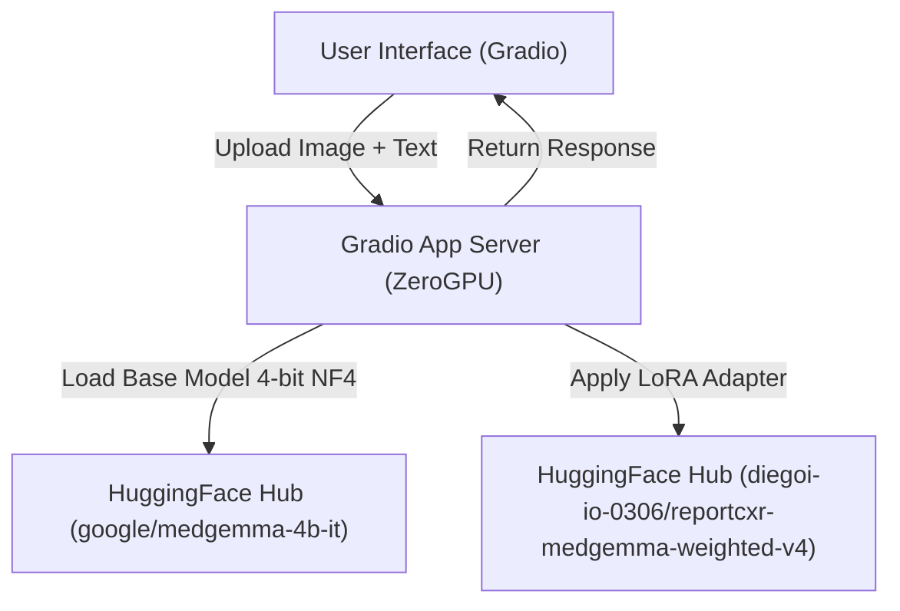

::: {.non-technical-summary}
##### Section Summary (Non-Technical)
This section documents how the trained AI model is deployed as a live web application on HuggingFace Spaces. Instead of running a heavy, expensive server 24/7, we deploy the model using a **ZeroGPU** architecture. This dynamically allocates high-performance graphic card resources (A10G GPUs) only when a user uploads an X-ray and requests a report. The model is also compressed (quantized) to run efficiently on HuggingFace, showcasing a lightweight, cost-effective deployment pipeline.
:::

## Overview

The ReportCXR project includes a live web application demo deployed on HuggingFace Spaces:

> **Live Demo**: [ReportCXR-Demo on HuggingFace Spaces](https://huggingface.co/spaces/diegoi-io-0306/ReportCXR-Demo)
>
> **Warning**: *Research demo only. Not for clinical use.*

This web interface serves our best-performing rare-pathology model adapter: `weighted_v4` (trained using the class Effective Sample Size (ESS) WeightedRandomSampler).

---

## 1. Web Application Architecture

The demo is implemented using Gradio (v5.29.0) and HuggingFace Spaces ZeroGPU compute. It is divided into two distinct interactive tabs:

1.  **Structured Report (Trained Format)**: Generates a radiology Findings section from an X-ray and an optional Clinical Indication input. This format uses the exact same template and system prompt as our test evaluations:
    ```
    You are an expert radiologist. Write only the Findings section...
    Indication: {clinical_indication}
    Findings:
    ```
2.  **Free Chat (Interactive Conversational)**: Exploits MedGemma’s instruction-tuning by allowing users to ask open-ended questions about the uploaded image. The chat interface maintains the conversation history as context for follow-up questions.



---

## 2. Light MLOps & Deployment Lifecycle

The deployment process follows a lightweight, serverless MLOps design:

### 2.1 Model Hub Serialization
After finishing training, the QLoRA adapter weights (which represent the Low-Rank Adaptation matrices of rank $r=16$) are saved and uploaded directly to the HuggingFace Hub repository: [diegoi-io-0306/reportcxr-medgemma-weighted-v4](https://huggingface.co/diegoi-io-0306/reportcxr-medgemma-weighted-v4).
Because we only save the PEFT (Parameter-Efficient Fine-Tuning) adapter weights rather than the full 4B parameter model, the uploaded artifact size is extremely small (**~68 MB**), making deployment rapid and bandwidth-efficient.

### 2.2 On-Demand Compute (HuggingFace ZeroGPU)
To run a 4B parameter model with low latency, GPU acceleration is required. However, keeping a dedicated GPU server running 24/7 is financially expensive. We implement **ZeroGPU** serving:
*   We use the `@spaces.GPU` decorator inside the application code.
*   When a user clicks "Generate Report" or sends a chat message, HuggingFace's scheduler dynamically routes the query to an available **NVIDIA A10G GPU** (24 GB VRAM) for the duration of the forward pass.
*   Once the generation is complete, the GPU resources are released back to the shared pool, ensuring cost-effective, serverless execution.

### 2.3 Quantized Loading on the Edge
To fit the model within HuggingFace's environment, we load the base model in 4-bit precision using `BitsAndBytesConfig`:
*   **Quantization**: Loaded in 4-bit NormalFloat (NF4) with double quantization.
*   **Precision**: Compute data type set to `torch.bfloat16`.
*   **VRAM Optimization**: Quantization reduces the VRAM requirement of the Gemma decoder to under 4 GB, allowing it to load quickly and execute with a minimal memory footprint.

---

## 3. Demo Codebase Structure

The demo deployment files are maintained under the [demo/](file:///Users/diegovillaba/Code/ReportCXR/demo) folder:

1.  **[demo/app.py](file:///Users/diegovillaba/Code/ReportCXR/demo/app.py)**: The main application entrypoint. It loads the base model and Peft adapter, defines the inference wrapper functions (with `@spaces.GPU` decoration), and constructs the Gradio block layout.
2.  **[demo/requirements.txt](file:///Users/diegovillaba/Code/ReportCXR/demo/requirements.txt)**: Specifies package dependencies needed for HuggingFace (e.g. `gradio`, `spaces`, `transformers`, `peft`, `bitsandbytes`, `accelerate`).
3.  **[demo/README.md](file:///Users/diegovillaba/Code/ReportCXR/demo/README.md)**: YAML metadata file configuring HuggingFace Space properties (Space title, SDK type, license, and hardware requirements).
