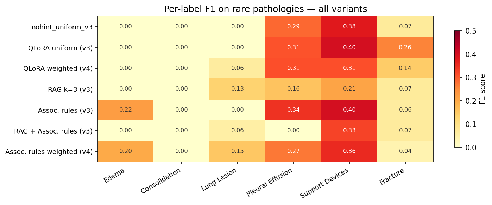
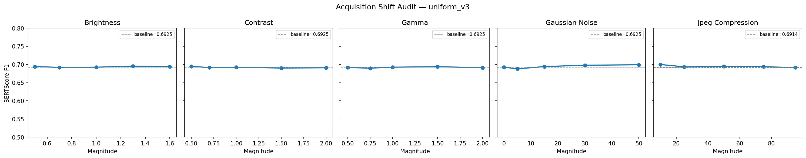

::: {.non-technical-summary}
##### Executive Summary (Non-Technical)
This project builds an AI system that reads chest X-rays and writes the Findings section of a radiology report—automatically. Rather than optimizing for a single benchmark, the work frames deployment across geographies as a **distributional shift problem**: medical AI trained on US hospital data regularly fails when moved to clinics in other regions due to differences in scanner hardware, patient populations, and reporting conventions.

The system fine-tunes Google's MedGemma 4B-it via QLoRA, then experiments with two inference-time strategies—case-based retrieval (RAG) and statistical label priors from association rules—to improve rare-pathology detection without additional training. The best configuration achieves a **+30% improvement in rare-label recall** over the zero-shot baseline. A publicly available interactive demo allows uploading a chest X-ray and generating reports or asking free-form questions.
:::

---

## What Was Built

**Model:** `google/medgemma-4b-it` (frozen SigLIP vision encoder + Gemma 3 4B decoder) fine-tuned with QLoRA (rank 16, NF4 4-bit, target: `{q,k,v,o}_proj`) on the Indiana University Chest X-Ray dataset (3,955 train / 600 test studies). An ESS-based `WeightedRandomSampler` oversamples rare-label studies to counteract the dataset's 83% "No Finding" rate.

**Evaluation:** Primary metric is CheXbert macro-F1 over 14 pathology labels (captures rare-label performance). Secondary: BERTScore-F1 with `microsoft/deberta-xlarge-mnli` (captures report fluency). All configurations are compared against matched **fair baselines** that use the identical prompt format but without the conditioning signal, isolating the causal effect of each strategy.

**Training compute:** Both QLoRA runs (`uniform_v3` and `weighted_v4`) were trained on **Kaggle free GPU tier (2× NVIDIA T4, 16 GB VRAM total)** — no paid cloud resources. 4-bit NF4 quantization via bitsandbytes made the 4B-parameter model fit within this budget.

**Infrastructure:** DVC pipeline for data versioning, Weights & Biases for experiment tracking, and a `DomainShiftAudit` class for systematic robustness evaluation under simulated distribution shifts.

---

## Experimental Results

### Performance Landscape

Ten configurations were evaluated end-to-end on the holdout test set. The results reveal a **Pareto frontier** rather than a single dominant method: RAG maximises report fluency at the cost of clinical label precision; association rule conditioning achieves the inverse.

::: {layout="[1, 1]"}
{#fig-pareto}

{#fig-heatmap}
:::

### Summary Table

| Configuration | BERTScore-F1 | micro-F1 | macro-F1 | BLEU-4 | ROUGE-L |
|---|---|---|---|---|---|
| Zero-shot MedGemma | 0.6938 | 0.3967 | 0.1416 | 0.0957 | 0.2631 |
| Fine-tuned fair baseline (`nohint_weighted_v4`) | 0.6876 | 0.4526 | 0.1578 | 0.1076 | 0.2720 |
| RAG k=3 (`rag_k3_uniform_v3`) | **0.7076** | 0.3432 | 0.1160 | **0.1391** | **0.3051** |
| **Assoc. rules + ESS (`assoc_rules_weighted_v4`)** | 0.6862 | **0.4559** | **0.1841** | 0.1073 | 0.2713 |

### Key Findings

- **Zero-shot collapse**: MedGemma zero-shot predicts "No Finding" for 92.8% of studies; 7 of 14 pathology labels score F1 = 0.
- **QLoRA gains**: Fine-tuning with ESS weighting raises macro-F1 from 0.1416 → 0.1578 over the fair baseline (+11.4%).
- **RAG label noise**: 57.5% of retrieved reference reports share zero active labels with the target study (Jaccard = 0). The model copies incorrect findings verbatim, boosting fluency metrics while degrading clinical recall (macro-F1 −0.029 vs. baseline).
- **Assoc. rules unlock rare labels**: `Edema`—F1 = 0 in all runs without conditioning—rises to **0.200** with association rule hints on `weighted_v4`. ESS training and inference-time conditioning are additive because they operate at different pipeline stages (backprop vs. attention).
- **Destructive interference**: Combining RAG + association rules collapses macro-F1 to 0.095 (worse than zero-shot). The RAG concrete template overrides the statistical hint in the model's attention.

::: {.callout-note}
**Known limitation**: A prompt format inversion exists between training (`Indication: {text}\nSYSTEM_PROMPT`) and inference (`SYSTEM_PROMPT\nIndication: {text}`). All ten test-set comparisons use the same inverted format, so relative rankings are valid, but absolute BERTScore may sit 1–2% below the achievable ceiling.
:::

---

## Domain Shift Audit

The `DomainShiftAudit` framework evaluates model robustness under two simulated distribution axes.

### Axis A: Acquisition & Equipment Shift *(Executed)*

Five synthetic image perturbations simulate scanner hardware variation: Gaussian noise, contrast scaling, gamma correction, JPEG compression, and brightness. All perturbations produce less than **1.3% BERTScore-F1 degradation** across the full tested range—including extreme conditions.

{#fig-acq-shift}

This apparent robustness is a **metric artefact**: under severe corruption the SigLIP encoder loses the visual signal and the decoder defaults to its language prior, producing fluent but clinically blind "everything is normal" reports. Because the test set is 83% "No Finding", these hallucinated normal reports score well on BERTScore.

### Axis C: Prevalence Shift *(Executed)*

Test-set metrics are re-weighted via importance sampling to simulate a LATAM epidemiological distribution with higher pathology prevalence. The ESS (`weighted_v4`) model shows significantly more stable macro-F1 than the uniform model as pathology prevalence increases, directly validating the training-time weighting strategy.

---

## Live Interactive Demo

The fine-tuned adapter is publicly available and deployed on HuggingFace Spaces:

| Resource | Link |
|---|---|
| Adapter weights (~48 MB) | [`diegoi-io-0306/reportcxr-medgemma-weighted-v4`](https://huggingface.co/diegoi-io-0306/reportcxr-medgemma-weighted-v4) |
| Interactive Space | [`diegoi-io-0306/ReportCXR-Demo`](https://huggingface.co/spaces/diegoi-io-0306/ReportCXR-Demo) |
| Source code | [`DiegoViillalba/ReportCXR`](https://github.com/DiegoViillalba/ReportCXR) |

Upload a chest X-ray image to generate a structured Findings section or ask free-form questions in natural language. The model runs in 4-bit NF4 quantization on ZeroGPU (A10G).

> ⚠️ MedGemma requires accepting [Google's Health AI Developer Foundations license](https://huggingface.co/google/medgemma-4b-it). Research demo only — not for clinical use.

---

## Navigate This Report

| Section | What it covers |
|---|---|
| [1. Introduction](report/01_introduction.qmd) | Clinical motivation and strategic thesis |
| [2. Data & Sampler](report/02_data.qmd) | IU CXR dataset, label extraction, ESS weighting |
| [3. Model & QLoRA](report/03_model_training.qmd) | MedGemma architecture, training configuration |
| [4. Evaluation](report/04_evaluation.qmd) | Metric design, BERTScore monkey-patch, CheXbert pipeline |
| [5. Inference Conditioning](report/05_inference_conditioning.qmd) | RAG, association rules, ablation results |
| [6. Domain Shift Audit](report/06_domain_shift.qmd) | Acquisition and prevalence shift experiments |
| [7. Production Scaling](report/07_production_scaling.qmd) | HF Spaces deployment, quantization, ZeroGPU |

---

## Reproducibility

Every parameter is declared in `params.yaml`. The full pipeline is managed by DVC:

```bash
dvc status   # check artifact state
dvc repro    # reproduce all stages: load → labels → split → eda → train → eval
```

| DVC Stage | Description |
|---|---|
| `load` | Join reports/projections CSVs, link image paths |
| `labels` | CheXbert labeling → 14-dim binary matrix |
| `split` | Multi-label stratified split, no patient leakage |
| `train_uniform` | QLoRA on uniform distribution |
| `train_weighted` | QLoRA with ESS WeightedRandomSampler |
| `eval` | Test-set metrics on best checkpoints |

Training runs, validation curves, and sampler weight distributions are tracked in Weights & Biases under project `reportcxr`.
