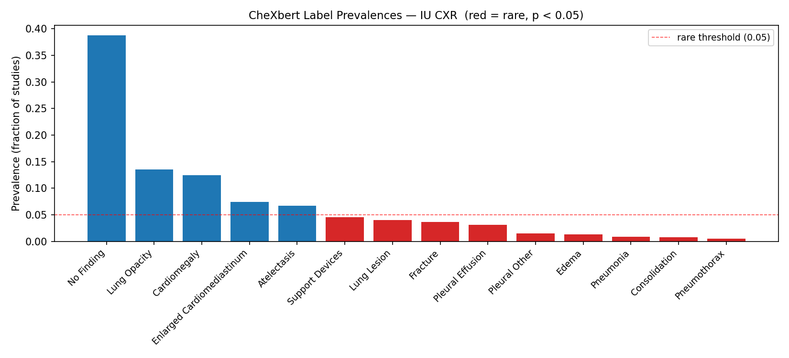
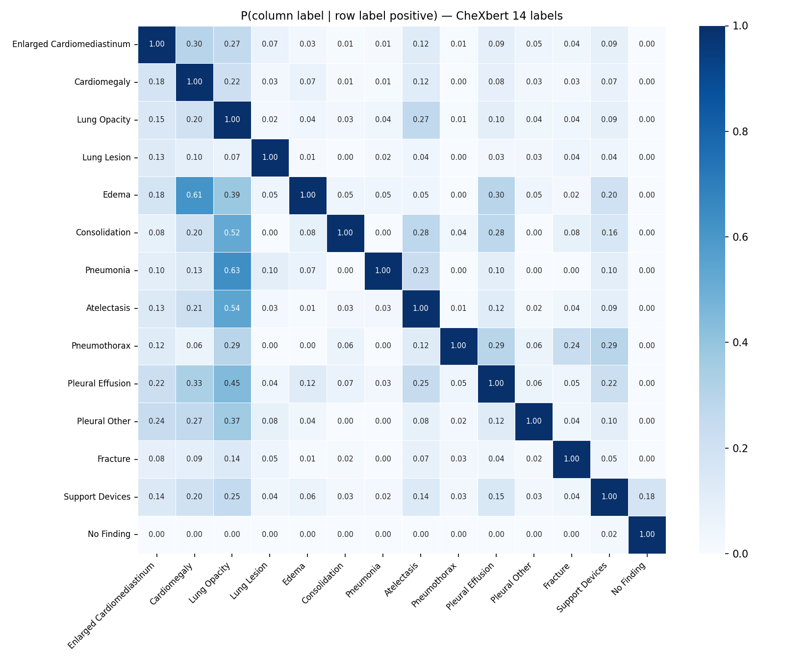
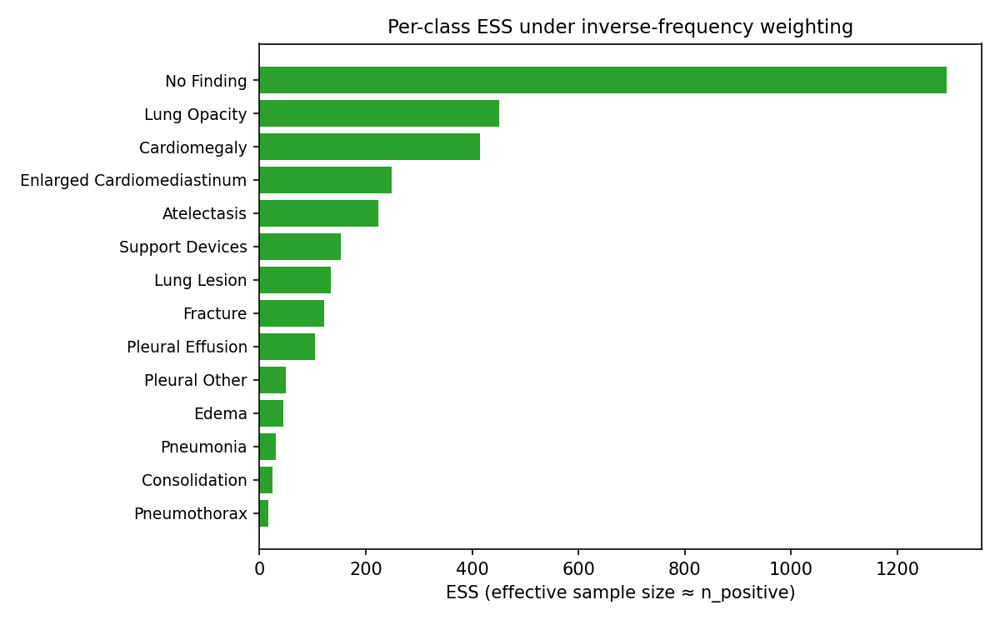
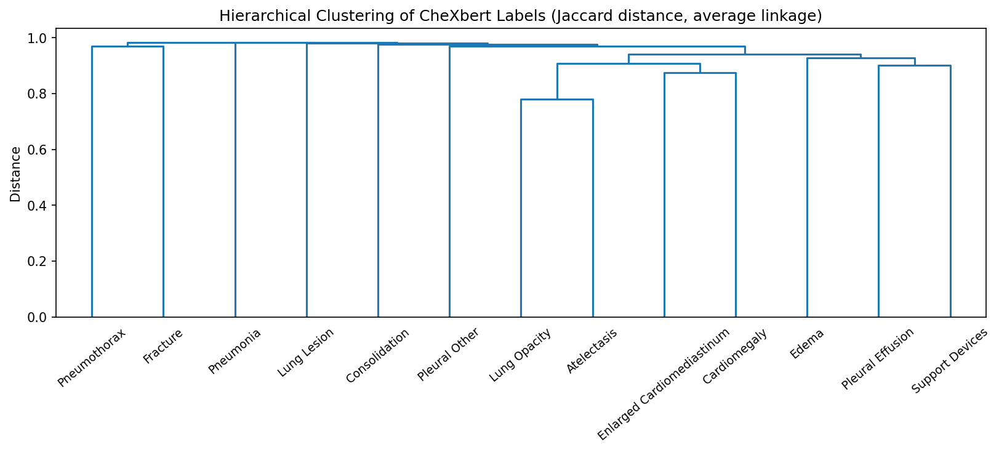
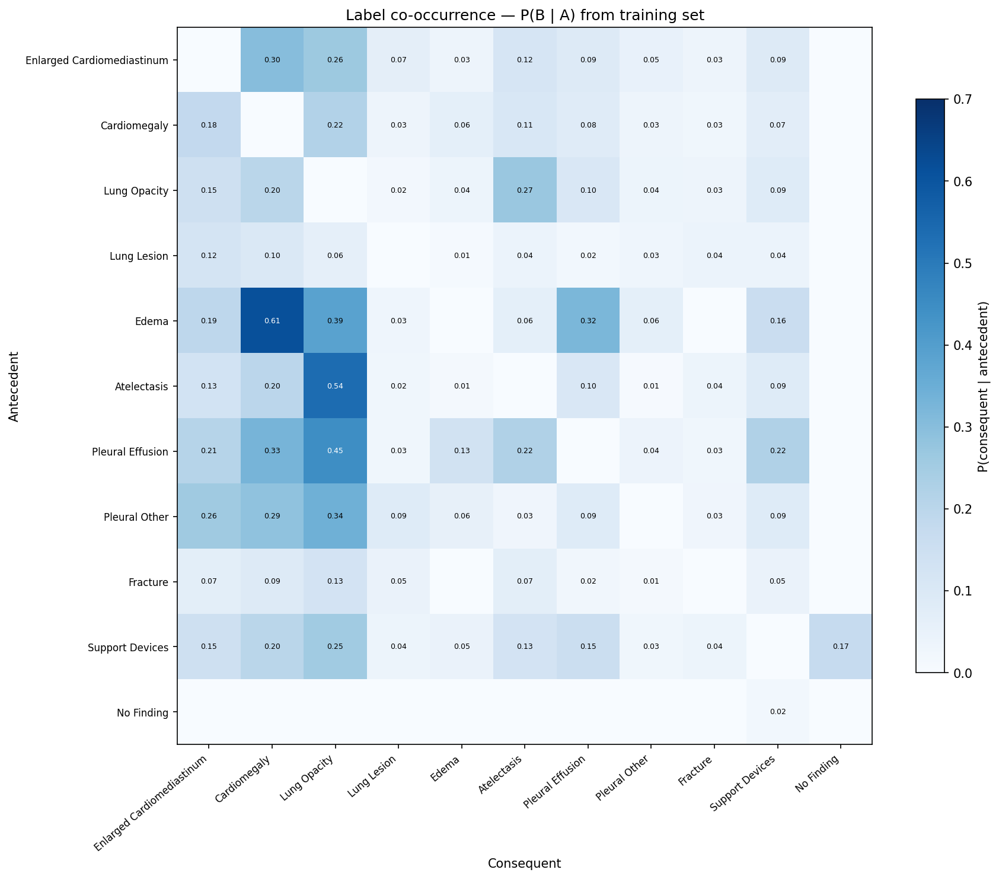

::: {.non-technical-summary}
##### Section Summary (Non-Technical)
This section explains how we handle the huge imbalance in clinical data. Most X-rays are completely normal, meaning that an AI trained on this data would quickly learn to default to predicting "normal" to get easy high scores. We solve this by calculating mathematical weights for each study. When the AI trains, it is shown rare pathologies more frequently and normal X-rays less frequently. This forces the model to actually learn the signatures of rare diseases rather than taking lazy shortcuts.
:::

## 1. Dataset Loading & Integrity Audit

The Indiana University Chest X-ray (IU CXR) dataset consists of two raw CSV files:

- **`indiana_reports.csv`** — 3,851 rows × 8 columns (`uid`, `MeSH`, `Problems`, `image`, `indication`, `comparison`, `findings`, `impression`)
- **`indiana_projections.csv`** — 7,466 rows × 3 columns (`uid`, `filename`, `projection`)

Each study (`uid`) links to one or two image projections. Reports and projections are joined on `uid` to produce a per-study dataframe (one row per study, with `frontal` and `lateral` image lists as columns).

### 1.1 Projection Coverage

| Projections per study | Studies |
|---|---|
| 1 | 446 |
| 2 | 3,210 |
| 3 | 181 |
| 4 | 13 |
| 5 | 1 |

Of the 3,851 studies: **3,689 have at least one frontal image** and **3,550 have a lateral image**. The 162 studies lacking a frontal view are still retained in the join — the model always receives the frontal image at training time; if unavailable, the study is skipped.

### 1.2 Null Counts in Raw Reports

| Column | Missing |
|---|---|
| `indication` | 86 |
| `comparison` | 1,166 |
| `findings` | 514 |
| `impression` | 31 |

### 1.3 Usable Study Count

Studies without a `findings` text cannot be used as generation targets and are dropped:

$$N_{\text{raw}} = 3{,}851 \xrightarrow{\text{drop empty findings}} N_{\text{usable}} = 3{,}337$$

This **3,337-study corpus** is the basis for all subsequent analysis, CheXbert labeling, and the train/test split.

---

## 2. CheXbert Labeling

Each study's `findings` text is passed through **CheXbert** [@chen2024chexagent], a BERT-based classifier that extracts a 14-dimensional binary label vector. The `uncertain_policy` is set to `positive` (uncertain mentions are treated as present).

Results are cached to `data/processed/chexbert_labels.parquet` after the first run (~10–20 min on CPU).

### 2.1 Positive Counts per Label

| Label | Positive studies | Prevalence |
|---|---|---|
| No Finding | 1,293 | **38.7%** |
| Lung Opacity | 450 | 13.5% |
| Cardiomegaly | 414 | 12.4% |
| Enlarged Cardiomediastinum | 249 | 7.5% |
| Atelectasis | 224 | 6.7% |
| Support Devices | 153 | 4.6% |
| Lung Lesion | 134 | 4.0% |
| Fracture | 121 | 3.6% |
| Pleural Effusion | 105 | 3.1% |
| Pleural Other | 49 | 1.5% |
| Edema | 44 | 1.3% |
| Pneumonia | 30 | 0.9% |
| Consolidation | 25 | 0.7% |
| Pneumothorax | 17 | 0.5% |

---

## 3. Dataset Distribution & Concentration

::: {#fig-dataset-dist layout="[[1, 1], [1]]"}
{#fig-prevalences}

{#fig-cooccurrence}

{#fig-ess}

Clinical data distributions and label statistics.
:::

The severe class imbalance is illustrated in @fig-prevalences and @fig-cooccurrence. Nine of the 14 labels have prevalence below 5% (highlighted in red in @fig-prevalences).

### 3.1 Dataset Concentration Metrics

To quantify how unequally the label mass is distributed, we compute Shannon entropy and effective number of labels:

$$H = -\sum_{l} \hat{p}_l \log \hat{p}_l = 2.005 \text{ nats}$$

$$K_{\text{eff}} = e^H = 7.42 \quad (\text{out of 14})$$

A uniform 14-label distribution would give $K_{\text{eff}} = 14$. A value of **7.42** means the dataset behaves as if only ~7 labels exist at equal prevalence — the remaining label mass is dominated by `No Finding`, `Lung Opacity`, and `Cardiomegaly`.

### 3.2 Tail Mass

We define the "tail" as studies whose only positive labels have prevalence < 5%. These studies carry signal for the rarest pathologies but receive almost no gradient under uniform sampling:

$$\text{Tail mass} = 8.2\% \approx 274 \text{ studies}$$

These 274 studies are the ones the importance-weighted sampler is most critical for — they are the first to be de-prioritized under uniform sampling.

---

## 4. Hierarchical Clustering & Label Associations

To understand how clinical findings co-occur and group together, we performed hierarchical agglomerative clustering on the binary CheXbert label vectors from the training set.

### 4.1 Hierarchical Agglomerative Clustering Implementation

Each label $l \in L$ is represented as a boolean occurrence vector $v_l \in \{0, 1\}^N$ over the $N = 3{,}337$ studies. We define the pairwise distance between label occurrence vectors using the Jaccard distance metric to measure the relative co-occurrence similarity:

$$d(A, B) = 1 - \frac{|A \cap B|}{|A \cup B|} = 1 - \frac{\sum_{i=1}^N (L_{i, A} \wedge L_{i, B})}{\sum_{i=1}^N (L_{i, A} \vee L_{i, B})}$$

The condensed distance matrix was computed via SciPy's `pdist`. We then performed agglomerative clustering via the average linkage method:

$$d(u, v) = \sum_{i \in u, j \in v} \frac{d(i, j)}{|u||v|}$$

The clustering tree was visualized as a dendrogram (see @fig-dendrogram), with the cluster color threshold set at $0.7 \times \max(Z[:, 2])$ to group labels into distinct clinical families.

::: {#fig-clustering-results layout="[1, 1]"}
{#fig-dendrogram}

{#fig-assoc-heatmap}

Clustering and co-occurrence analysis.
:::

The dendrogram in @fig-dendrogram reveals distinct clinical syndromes that align with medical logic:

1. **Cardiac Cluster**: Cardiomegaly, Edema, and Enlarged Cardiomediastinum group closely together, reflecting congestive heart failure progression.
2. **Infection/Airspace Cluster**: Pneumonia and Consolidation form a tight cluster, indicating airspace disease.
3. **Pleural Cluster**: Pleural Effusion and Pleural Other group together, showing pleural space pathology.

### 4.2 Top Conditional Co-occurrence Pairs

Before mining directional rules, the raw conditional co-occurrence matrix surfaces the strongest pairwise associations:

| Given (row) | Then (column) | P(col \| row) |
|---|---|---|
| Lung Opacity | Pneumonia | 0.633 |
| Cardiomegaly | Edema | 0.614 |
| Lung Opacity | Atelectasis | 0.540 |
| Lung Opacity | Consolidation | 0.520 |
| Lung Opacity | Pleural Effusion | 0.448 |
| Lung Opacity | Edema | 0.386 |
| Lung Opacity | Pleural Other | 0.367 |
| Cardiomegaly | Pleural Effusion | 0.333 |
| Cardiomegaly | Enlarged Cardiomediastinum | 0.297 |
| Pleural Effusion | Edema | 0.295 |

---

## 5. Association Rules Mining

This co-occurrence structure confirms that X-ray findings do not occur independently. To mine directional relationships between findings, we implemented association rules mining over the binary label matrix. `No Finding` is excluded from all rule mining — it is a logical complement label, not a pathology. This yields 90 directional candidate rules across 13 pathology labels.

For each candidate pair of pathologies $A \rightarrow B$, we compute:

1. **Support**: The joint prevalence of both findings in the dataset:
   $$\text{Support}(A \rightarrow B) = P(A \wedge B) = \frac{\sum_{i=1}^N L_{i, A} L_{i, B}}{N}$$
2. **Confidence**: The conditional probability of consequent $B$ given antecedent $A$:
   $$\text{Confidence}(A \rightarrow B) = P(B \mid A) = \frac{P(A \wedge B)}{P(A)} = \frac{\sum_{i=1}^N L_{i, A} L_{i, B}}{\sum_{i=1}^N L_{i, A}}$$
3. **Lift**: The ratio of confidence to the baseline prevalence of $B$. A lift greater than 1.0 indicates a positive clinical co-occurrence beyond random chance:
   $$\text{Lift}(A \rightarrow B) = \frac{P(B \mid A)}{P(B)} = \frac{N \sum_{i=1}^N L_{i, A} L_{i, B}}{\left(\sum_{i=1}^N L_{i, A}\right) \left(\sum_{i=1}^N L_{i, B}\right)}$$

We mined **90 total directional rules** across 13 pathology labels (excluding `No Finding`). Filtering at **confidence $\ge 0.25$** and **lift $\ge 1.5$** yields **12 clinically significant rules**:

| Antecedent ($A$) | Consequent ($B$) | Support | Confidence | Lift |
|---|---|---|---|---|
| **Edema** | Pleural Effusion | $0.0039$ | $0.2955$ | $9.3898$ |
| **Edema** | Cardiomegaly | $0.0081$ | $0.6136$ | $4.9461$ |
| **Atelectasis** | Lung Opacity | $0.0363$ | $0.5402$ | $4.0057$ |
| **Lung Opacity** | Atelectasis | $0.0363$ | $0.2689$ | $4.0057$ |
| **Pleural Effusion** | Lung Opacity | $0.0141$ | $0.4476$ | $3.3193$ |
| **Edema** | Lung Opacity | $0.0051$ | $0.3864$ | $2.8651$ |
| **Pleural Other** | Lung Opacity | $0.0054$ | $0.3673$ | $2.7241$ |
| **Pleural Effusion** | Cardiomegaly | $0.0105$ | $0.3333$ | $2.6868$ |
| **Enlarged Cardiomediastinum** | Cardiomegaly | $0.0222$ | $0.2972$ | $2.3955$ |
| **Pleural Other** | Cardiomegaly | $0.0039$ | $0.2653$ | $2.1385$ |
| **Enlarged Cardiomediastinum** | Lung Opacity | $0.0198$ | $0.2651$ | $1.9656$ |
| **Support Devices** | Lung Opacity | $0.0117$ | $0.2549$ | $1.8902$ |

These 12 rules (visualized in @fig-assoc-heatmap) represent highly strong, non-trivial clinical dependencies. For example: Edema has a 61.4% conditional probability of co-occurring with Cardiomegaly ($\text{lift}=4.95$), and is 9.39× more likely to co-occur with Pleural Effusion than a study drawn at random.

::: {.callout-note}
**EDA vs. inference thresholds**: The EDA strong-rules table above uses lift ≥ 1.5 for display purposes. The runtime inference conditioner in Section 5 uses a slightly more permissive lift ≥ 1.2 threshold to maximize recall of rare associations at inference time. All 12 rules above also satisfy the inference threshold.
:::

This motivates injecting these conditional probabilities into the prompting pipeline at test time: if a clinical indication triggers antecedent $A$, we supply the conditional probability of consequent $B$ as a soft prior context hint (see [Section 5 — Inference Conditioning](05_inference_conditioning.qmd)).

---

## 6. Importance Sampling & Sampler Correction

To prevent the model from collapsing to the majority class and simply predicting "normal" for all patients, we implement a `WeightedRandomSampler`. For each study $j$, we compute an importance weight $w_j$ based on the target prevalences specified in `params.yaml`:

$$w_j = \text{clip}\left( \left( \prod_{l \in L_j} \frac{p_{\text{target}}(l)}{p_{\text{dataset}}(l)} \right)^{\frac{1}{|L_j|}}, \text{clip\_val} \right)$$

Where:

*   $L_j$ is the set of positive pathologies present in study $j$.
*   $p_{\text{target}}(l)$ is the user-specified target prevalence for pathology $l$.
*   $p_{\text{dataset}}(l)$ is the empirical prevalence of pathology $l$ in the training set.
*   $\text{clip\_val}$ is the clipping multiplier (`sampler.weight_clip = 10.0`) to avoid high-variance gradients from extremely rare combinations.

For studies with no positive pathologies ("No Finding"), we assign a base weight:

$$w_j = \frac{p_{\text{target}}(\text{No Finding})}{p_{\text{dataset}}(\text{No Finding})}$$

Applying these weights at the batch-selection level forces the model to encounter rare pathology patterns during backpropagation without modifying the loss function, avoiding gradient-scale instabilities.

### 6.1 ESS-Based Sampler Settings (v4)

In the v4 training run, we configured the target prevalences $p_{\text{target}}$ in `params.yaml` directly using the class Effective Sample Size (ESS) metrics computed in @fig-ess:

1. **Common Pathologies (ESS > 250)**: No correction needed. Target prevalences set to null, defaulting to raw dataset prevalence (e.g. Enlarged Cardiomediastinum, Cardiomegaly, Lung Opacity, No Finding).
2. **Moderate Pathologies (ESS 50–224)**: Boosted to a 10% target prevalence (e.g. Atelectasis, Support Devices, Lung Lesion, Fracture, Pleural Effusion).
3. **Rare Pathologies (ESS < 50)**: Aggressively boosted to a 5% target prevalence (e.g. Pleural Other, Edema, Pneumonia, Consolidation, Pneumothorax).

| ESS tier | Labels | Target prevalence |
|---|---|---|
| High (ESS > 250) | Enlarged Cardiomediastinum, Cardiomegaly, Lung Opacity, No Finding | Dataset prevalence (no change) |
| Moderate (ESS 50–224) | Atelectasis, Support Devices, Lung Lesion, Fracture, Pleural Effusion | 10% |
| Rare (ESS < 50) | Pleural Other, Edema, Pneumonia, Consolidation, Pneumothorax | 5% |

This structured up-weighting guarantees that the backpropagated gradients contain meaningful representations of rare clinical conditions, preventing the training loop from defaulting to the dominant "normal" mode.
