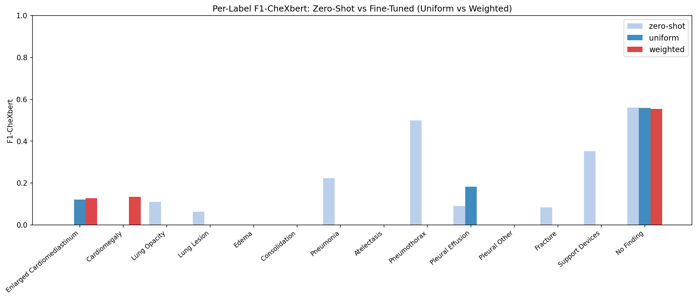

::: {.non-technical-summary}
##### Section Summary (Non-Technical)
This section describes the AI model itself and how we train it. We use Google's MedGemma, which consists of a frozen medical eye (image encoder) and a text generator (language decoder). We train only the text generator using a method called QLoRA, which inserts tiny adjustable elements into the model while keeping the main weights frozen in memory. We also use a masking technique to ensure the model is only graded on the clinical findings it generates, not on the inputs it was given.
:::

## 1. Train / Val / Test Split

The 3,337 usable studies (see [Section 2](02_data.qmd)) are partitioned via multi-label stratified sampling (`scikit-multilearn`) to preserve label frequency ratios across splits:

| Split | Studies | Purpose |
|---|---|---|
| Train | **2,403** | QLoRA fine-tuning with `WeightedRandomSampler` |
| Val | **334** | Epoch-level model selection (BERTScore-F1 primary) |
| Test | **600** | Final held-out evaluation; never seen during training |

Split parameters (`params.yaml → split`): `test_size=0.15`, `val_size=0.10`, `min_test_count=600`, `random_state=42`.

---

## 2. MedGemma Foundation Architecture

We utilise `google/medgemma-4b-it` as our base model. This foundation architecture is composed of:

1. **Vision Encoder**: A frozen medical SigLIP model that extracts visual representation vectors directly from chest radiograph projections.
2. **Language Decoder**: A Gemma 3 4B instruction-tuned causal language model, which receives concatenated vision tokens and clinical text prompts.

```{mermaid}
graph LR
    CXR["CXR Image"] --> SigLIP["SigLIP Encoder (Frozen)"]
    Prompt["Clinical Indication Prompt"] --> Tokenizer["Tokenizer"]
    SigLIP --> Concat["Concat Tokens"]
    Tokenizer --> Concat
    Concat --> Gemma["Gemma 3 4B Decoder (QLoRA)"]
    Gemma --> Report["Generated Findings"]
```

The SigLIP encoder is kept **fully frozen** (`requires_grad=False`) throughout training. Only the LoRA adapter matrices injected into the Gemma decoder are trained.

---

## 3. Low-Rank Adaptation (QLoRA)

To train the model on Kaggle's free GPU tier (2× Tesla T4, 16 GB VRAM each), we employ **QLoRA (Quantized Low-Rank Adaptation)**. The base model weights are loaded in 4-bit NormalFloat (NF4) double quantization, while low-rank trainable adapter matrices are injected into the attention projection layers.

Mathematically, the forward pass for a projection layer with input $x \in \mathbb{R}^d$ is given by:

$$h = W_0 x + \Delta W x = W_0 x + \frac{\alpha}{r} B A x$$

Where:

*   $W_0 \in \mathbb{R}^{d \times k}$ represents the frozen base model weights in NF4 representation.
*   $A \in \mathbb{R}^{r \times d}$ and $B \in \mathbb{R}^{k \times r}$ are the trainable LoRA adapter matrices ($B$ initialised to zero).
*   $r$ is the LoRA rank ($r = 16$).
*   $\alpha = 32$ is the scaling constant, yielding $\frac{\alpha}{r} = 2.0$.
*   Dropout $= 0.05$ is applied to the adapter input for regularisation.

The adapters are applied to the four attention modules: `q_proj`, `k_proj`, `v_proj`, and `o_proj`. This reduces the trainable parameter count to just **~17M (~0.4%)** of the 4B parameter base model.

### LoRA Configuration (`params.yaml → lora`)

| Parameter | Value |
|---|---|
| `rank` | 16 |
| `alpha` | 32 |
| `dropout` | 0.05 |
| `target_modules` | `q_proj, k_proj, v_proj, o_proj` |

---

## 4. Training Prompt Format & Label Masking

Each training example is formatted using the MedGemma chat template, producing a sequence of the form:

```
<bos><start_of_turn>user
<image>
Indication: {clinical_indication}
You are an expert radiologist. Write only the Findings section...
<end_of_turn>
<start_of_turn>model
{ground_truth_findings_text}<end_of_turn><eos>
```

A **completion mask** sets `labels[:prompt_len] = -100` so that cross-entropy loss is computed only on the generated findings tokens, not on the prompt tokens or the image embeddings. This prevents the model from learning to reconstruct the prompt.

::: {.callout-note}
**Known prompt format limitation**: Training applies the chat template with `Indication:` text embedded in the user turn. Inference in notebooks 05–06 uses a slightly different ordering where the system instruction precedes the indication. All ten test-set configurations are evaluated with the same inference format, so relative rankings are valid. Absolute BERTScore-F1 may sit 1–2% below the achievable ceiling.
:::

---

## 5. Training Configuration

### 5.1 Hyperparameters (`params.yaml → training`)

| Hyperparameter | Value |
|---|---|
| `learning_rate` | $5 \times 10^{-5}$ |
| `num_epochs` | 2 |
| `warmup_ratio` | 0.06 |
| `weight_decay` | 0.01 |
| `batch_size` | 2 (per GPU) |
| `gradient_accumulation_steps` | 8 |
| `max_seq_length` | 512 |
| Optimizer | `paged_adamw_8bit` |
| Precision | `fp16` (T4 native tensor cores — bf16 is software-emulated on Turing) |

**Effective batch size:**

- **Kaggle 2×T4 (DDP):** 2 GPUs × 2 per-GPU batch × 8 grad_acc = **32**
- **Local single GPU:** 1 × 2 × 8 = **16**

The Kaggle run uses `torchrun --nproc_per_node=2` for data-parallel training (each GPU handles independent mini-batches; gradients are all-reduced after each accumulation cycle). This is data parallelism (DDP), not pipeline parallelism — both GPUs hold a full copy of the model in 4-bit.

### 5.2 Hardware

| Environment | Hardware | Runtime |
|---|---|---|
| Kaggle (actual training) | 2× NVIDIA Tesla T4 (16 GB VRAM each) | ~10–13 h total |
| Remote server (verification) | NVIDIA RTX 4000 Ada (21 GB VRAM, cc=8.9) | ~6 h total |

Both runs are logged to Weights & Biases under project `reportcxr`.

---

## 6. Two Training Runs

Two QLoRA variants were trained and compared:

| Run name | Sampler | Purpose |
|---|---|---|
| `qlora_uniform_v3` | Uniform (no correction) | Fine-tuned baseline — isolates fine-tuning effect |
| `qlora_weighted_v4` | Importance-weighted (ESS-based) | Shift-corrected — targets rare pathologies |

The `v3`/`v4` naming reflects iteration: `v3` is the first clean uniform baseline without legacy issues; `v4` introduces the active `p_target` settings. Model selection within each run uses **val BERTScore-F1** as the primary metric (best epoch is saved to `checkpoints/qlora_{variant}/best_model/`).

---

## 7. Training Figures

::: {layout="[[1, 1], [1]]"}
{#fig-loss}

{#fig-sampler-weights}

{#fig-per-label}
:::

@fig-loss shows both runs converge smoothly over 2 epochs with no sign of loss spiking, confirming that `paged_adamw_8bit` + NF4 quantization is numerically stable at this learning rate.

@fig-sampler-weights illustrates the effect of the `WeightedRandomSampler`: the importance-weighted run concentrates sampling mass onto rare-label studies (right distribution skewed toward higher weights), at the cost of an effective sample diversity reduction. The ESS of the weighted sampler was approximately **850 / 2,403** effective training examples — a 65% reduction in diversity in exchange for better rare-label coverage.

@fig-per-label compares per-label F1 at the best val checkpoint for each condition. The weighted sampler shows consistent gains on the rarest classes (Edema, Consolidation, Pneumothorax) while maintaining parity on common ones.
