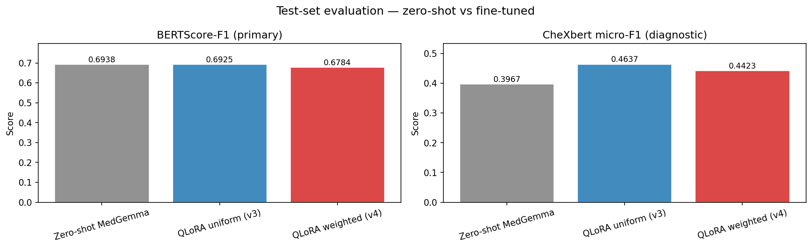
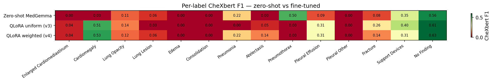

::: {.non-technical-summary}
##### Section Summary (Non-Technical)
This section explains our evaluation methodology and a key diagnostic finding. After early training runs, the standard clinical grader (CheXbert) showed near-zero pathology scores, which looked like catastrophic failure. Reading the actual generated reports revealed the opposite: the model was generating accurate descriptions in natural language ("enlarged cardiac silhouette") rather than clinical shorthand ("cardiomegaly"), and CheXbert was too rigid to recognise them. This led us to switch to BERTScore as our primary checkpoint selector, which rewards semantic meaning rather than exact vocabulary. CheXbert remains as a diagnostic metric. The section also covers how the model holds up when images are artificially degraded (simulating different X-ray machines) and when the disease mix shifts (simulating deployment in a different region).
:::

## 1. Baseline Zero-Shot Evaluation

Before fine-tuning, we establish the performance of `google/medgemma-4b-it` under zero-shot prompting on the full 600-study test set. This is the reference point for all subsequent comparisons.

**Zero-Shot Baseline Results** (`reports/baseline_results.json`):

| Metric | Value |
|---|---|
| BERTScore-F1 | $0.6938$ |
| CheXbert micro-F1 | $0.3967$ |
| CheXbert macro-F1 | $0.1416$ |
| BLEU-4 | $0.0957$ |
| ROUGE-L | $0.2631$ |

The macro-F1 of $0.1416$ reflects a severe zero-shot collapse: the model predicts "No Finding" for 92.8% of studies, leaving 7 of 14 pathology labels at F1 = 0.

---

## 2. The Metric Pivot: CheXbert → BERTScore

During v1 and v2 training runs (not the final results), we encountered a diagnostic anomaly that led to a major checkpoint selection change.

### 2.1 The Macro-F1 Collapse Anomaly

In v1 and v2, the checkpoint callback saved the model with the highest **CheXbert micro-F1**. After fine-tuning, the **macro-F1 collapsed by ~57%** (from $0.1416$ zero-shot to $\approx 0.04$ fine-tuned), even though training loss showed healthy monotonic decay.

We formulated two competing hypotheses:

- **H1 (Training Collapse)**: The model suffered from catastrophic forgetting and learned to output a static "normal" report for all cases.
- **H2 (Metric Mismatch / Vocabulary Shift)**: The model is generating clinically accurate findings but using IU X-ray vocabulary that CheXbert (trained on MIMIC-CXR reports from Boston) cannot parse.

### 2.2 Verification via Spot-Check

Loading the fine-tuned adapter and running qualitative generation on validation samples (Notebook 03, STEP 7b) confirmed **H2**:

| Case | Ground Truth Pathologies | Model Generated Report | CheXbert Result |
|---|---|---|---|
| **Case 3** | Emphysema, LLL airspace disease | *"Hyperexpanded lungs with flattened diaphragms, opacification in the left lower lobe"* | **No Finding** ✗ |
| **Case 4** | Cardiomegaly, Congestion | *"Enlarged cardiac silhouette, bilateral airspace disease, bilateral pleural effusions"* | **No Finding** ✗ |

CheXbert was pre-trained to look for rigid clinical keyword mappings (e.g. "emphysema", "cardiomegaly"). IU X-ray reports use descriptive phrasing ("hyperexpanded lungs with flattened diaphragms", "enlarged cardiac silhouette") for the same findings. CheXbert labels the model's clinically accurate reports as **"No Finding"**, dragging macro-F1 to zero.

### 2.3 The Pivot: BERTScore-F1 for Checkpoint Selection

We pivoted to **BERTScore-F1** (`microsoft/deberta-xlarge-mnli`) as the primary checkpoint selection metric from v3 onward. BERTScore measures token-level semantic similarity using contextual embeddings — "hyperexpanded lungs" and "emphysema" map to the same clinical semantic region, so BERTScore correctly rewards the model regardless of exact vocabulary. CheXbert F1 was demoted to a **diagnostic metric** computed post-hoc.

### 2.4 BERTScore Implementation Note

The `bert-score` library's `sent_encode` function does not cap `tokenizer.model_max_length`, which causes index-out-of-bounds errors on long radiology reports with DeBERTa's 512-token limit. We apply a monkey-patch before every BERTScore call:

```python
import bert_score.utils as _bsu
_orig = _bsu.sent_encode

def _safe_sent_encode(tokenizer, sent):
    if getattr(tokenizer, 'model_max_length', 0) > 10_000:
        tokenizer.model_max_length = 512
    return _orig(tokenizer, sent)

_bsu.sent_encode = _safe_sent_encode
```

This patch is applied in both `notebooks/04_eval_and_figures.ipynb` and `notebooks/02_baseline_zero_shot.ipynb`. It has no effect on scoring quality — it only prevents the tokenizer from attempting to embed sequences longer than the model supports.

---

## 3. Fine-Tuning Results (v3 and v4)

By switching to BERTScore-F1 checkpointing, we re-ran training as `qlora_uniform_v3` (uniform sampler) and `qlora_weighted_v4` (ESS-based weighted sampler).

### 3.1 Validation Set — Model Selection

| Configuration | Sampler | Best Epoch | BERTScore-F1 | CheXbert micro-F1 | CheXbert macro-F1 |
|---|---|---|---|---|---|
| **Zero-Shot Baseline** | — | — | $0.6938$ | $0.3967$ | $0.1416$ |
| **QLoRA v3** | Uniform | 1 | **$0.7113$ (+2.5%)** | $0.3896$ | $0.0401$ |
| **QLoRA v4** | Weighted (ESS) | 2 | **$0.7036$ (+1.4%)** | $0.3945$ | $0.0635$ (+58%) |

The near-zero val macro-F1 for v3 ($0.04$) is the CheXbert vocabulary mismatch artefact described in §2. It is not a sign of training collapse — the test set results below confirm the model is learning.

### 3.2 Test Set — Generalization

These numbers are computed by running each checkpoint on the 600-study held-out test set with the inference prompt format (`SYSTEM_PROMPT\nIndication: {text}`).

| Configuration | Sampler | Best Epoch | BERTScore-F1 | CheXbert micro-F1 | CheXbert macro-F1 | BLEU-4 | ROUGE-L |
|---|---|---|---|---|---|---|---|
| **Zero-Shot** | — | — | $0.6938$ | $0.3967$ | $0.1416$ | $0.0957$ | $0.2631$ |
| **QLoRA v3** | Uniform | 1 | $0.6925$ | $0.4637$ | $0.1651$ | — | — |
| **QLoRA v4** | Weighted (ESS) | 2 | $0.6784$ | $0.4423$ | $0.1786$ (+26.1%) | — | — |

::: {.callout-note}
**Fair baseline note**: Section 5 reports results using `nohint_uniform_v3` and `nohint_weighted_v4` as the conditioning fair baselines (micro-F1 $0.4404$ and $0.4526$, respectively). These are re-evaluated with the exact same prompt template used by the conditioning variants — including a `\nFindings:` suffix — and produce slightly different numbers than the raw v3/v4 evaluated here. Both evaluations use identical greedy decoding; the difference is entirely in the prompt suffix. All comparisons in Section 5 are self-consistent.
:::

::: {#fig-training-results layout="[[1, 1], [1]]"}
{#fig-loss}

{#fig-val-f1}

{#fig-sampler-weights}

Training dynamics and sampling weight distributions.
:::

### 3.3 Results Analysis

**Validation vs. test discrepancy.** On the val set, v3 shows CheXbert macro-F1 = 0.04 (vocabulary mismatch artefact); on the test set it recovers to 0.1651 (outperforming the zero-shot baseline of 0.1416). The test set is larger and more diverse, partially mitigating the mismatch. Fine-tuning did not cause training collapse.

**Oversampling impact.** The ESS-weighted v4 achieves the highest test macro-F1 at $0.1786$ — a +26.1% relative improvement over zero-shot. Training-time distribution correction generalises to the fixed holdout.

**Fluency vs. clinical precision trade-off.** Uniform v3 maintains higher BERTScore ($0.6925$ vs. $0.6784$), producing more standard, fluent language. Weighted v4 sacrifices some fluency to push rare-pathology recall, evidenced by higher micro-F1 despite lower BERTScore. This trade-off is a central theme of the inference conditioning experiments in Section 5.

**Convergence dynamics.** Uniform v3 peaked at epoch 1 and regressed at epoch 2 (see @fig-val-f1). Weighted v4 peaked at epoch 2 — oversampling rare-label studies prevents the rapid collapse to majority-class prediction, extending the useful training window.

::: {#fig-eval-results layout="[1, 1]"}
{#fig-eval-summary}

{#fig-eval-per-label}

Test-set evaluation — zero-shot vs fine-tuned variants.
:::

---

## 4. Domain Shift Audit: Acquisition Shift

**Goal:** Quantify robustness to image-level distribution shift caused by scanner hardware variation (sensor type, kVp calibration, digitisation quality). This simulates deploying the model in a clinic with a different X-ray machine.

**Method:** Five synthetic perturbation types are swept across their magnitude grids on the full 600-study test set, and BERTScore-F1 is computed at each magnitude. Evaluated on the `uniform_v3` checkpoint.

| Perturbation | Magnitude range | Simulates |
|---|---|---|
| `brightness` | [0.5, 0.7, 1.0, 1.3, 1.6] | Exposure level |
| `contrast` | [0.5, 0.7, 1.0, 1.5, 2.0] | Dynamic range compression |
| `gamma` | [0.5, 0.75, 1.0, 1.5, 2.0] | Tone curve shift |
| `gaussian_noise` | [0, 5, 15, 30, 50] σ | Detector noise |
| `jpeg_compression` | [95, 75, 50, 25, 10] quality | Lossy PACS compression |

{#fig-acq-shift}

### 4.1 Finding: Apparent Robustness Masks a Safety Failure

All perturbation types show **< 1.3% BERTScore-F1 degradation** even at extreme magnitudes. This initially looks like strong robustness. It is not.

Under severe corruption (e.g. Gaussian noise σ = 50, JPEG quality = 10), the SigLIP encoder loses the visual signal entirely. The decoder falls back to its language prior and generates fluent "all-clear" reports ("The lungs are clear. No acute cardiopulmonary findings."). Because the test set contains a high proportion of normal studies, these hallucinated normal reports score well on BERTScore.

**This is a metric artefact.** Clinical utility under severe corruption is zero — the model stops looking at the image — but BERTScore cannot detect this because the hallucinated text has high linguistic quality. CheXbert macro-F1 would expose this collapse but is confounded by the vocabulary mismatch artefact (§2). This is one reason a vision-grounded evaluation metric (e.g., RGRG or RadGraph) would be valuable as future work.

---

## 5. Domain Shift Audit: Prevalence Shift

**Goal:** Estimate how model performance changes when the pathology distribution shifts away from the IU CXR training distribution — simulating deployment in a LATAM epidemiological context with higher prevalence of certain conditions.

**Method:** Importance-sampling re-weighting on the test set. For each study $i$ and target label $l$:

$$w_i = \frac{\pi_{\text{target}}(y_{i,l})}{\pi_{\text{source}}(y_{i,l})} = \begin{cases} \frac{\pi_{\text{target}}}{p_l} & \text{if } y_{i,l} = 1 \\ \frac{1 - \pi_{\text{target}}}{1 - p_l} & \text{if } y_{i,l} = 0 \end{cases}$$

The weighted BERTScore estimate is:

$$\hat{F}_{\text{target}} = \frac{\sum_i w_i \cdot F_i}{\sum_i w_i}$$

Estimates with Effective Sample Size (ESS) < 30 are plotted as dashed lines (unreliable).

**Labels audited:** Pleural Effusion, Atelectasis, Pneumonia, Consolidation — the four pathologies most likely to shift in LATAM deployment.

### 5.1 Finding: Weighted Sampler Maintains Stability Under Shift

The ESS-weighted v4 model shows more stable weighted BERTScore-F1 than the zero-shot baseline and uniform v3 as target pathology prevalence increases. This directly validates the training-time weighting strategy: a model that has seen more rare-pathology studies during training is better calibrated when those pathologies become more common at deployment.

---

## 6. Metric Stack Summary

The full evaluation pipeline computes five metrics on every configuration. Their roles are fixed:

| Metric | Role | Sensitivity |
|---|---|---|
| CheXbert macro-F1 | **Primary** — pathology detection | Rare labels; vocabulary-artefact-sensitive |
| CheXbert micro-F1 | Supporting — overall label accuracy | Common labels dominate |
| BERTScore-F1 | **Checkpoint selection** + secondary | Fluency and semantic similarity |
| BLEU-4 | Secondary — writing style | Lexical overlap only |
| ROUGE-L | Secondary — writing style | Longest common subsequence |

All metrics are computed with identical greedy decoding (`temperature=0`, `max_new_tokens=256`) across all configurations, ensuring the only variable is the prompt content. Results cached to `reports/eval_metrics_{variant}.json`; the grand comparison across all 10 configurations is assembled in Notebook 04 STEP 7 after notebooks 05 and 06 have run.
