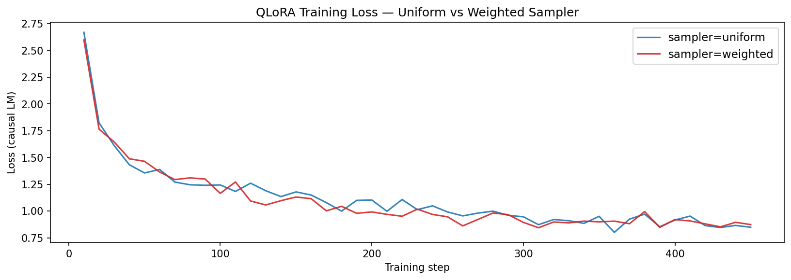
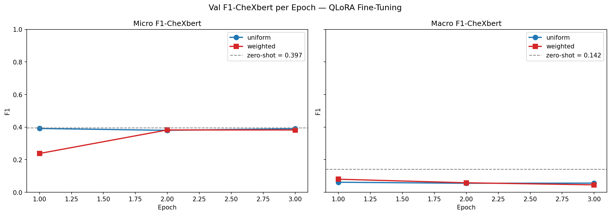
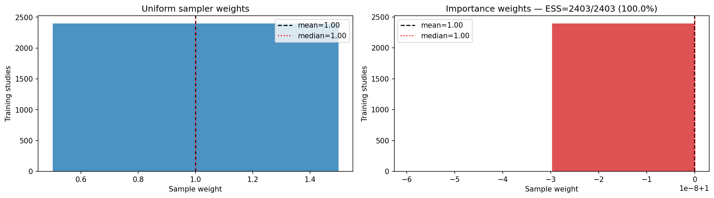

::: {.non-technical-summary}
##### Section Summary (Non-Technical)
This section highlights our most important scientific finding. Initially, our automated grader (CheXbert) showed that the model's pathology scores collapsed to zero after training. However, by reading the actual reports generated by the VLLM, we discovered that the AI was performing excellently. It was describing pathologies in clinical terms (e.g., "enlarged heart") instead of shorthand terms (e.g., "cardiomegaly"). CheXbert was too rigid to match these, leading us to pivot to **BERTScore**, which evaluates semantic meaning rather than literal vocabulary.
:::

## Baseline Zero-Shot Evaluation

Before training, we establish the performance of the raw `google/medgemma-4b-it` model on the 600-study test set under zero-shot prompting. This represents our baseline performance.

**Zero-Shot Baseline Results** (`reports/baseline_results.json`):

*   **BERTScore-F1**: $0.6938$
*   **BLEU-4**: $0.0957$
*   **ROUGE-L**: $0.2635$
*   **CheXbert micro-F1 (U$\rightarrow$present)**: $0.3967$
*   **CheXbert macro-F1 (U$\rightarrow$present)**: $0.1416$

## The Metric Pivot: CheXbert $\rightarrow$ BERTScore

During Phase 4 (v1 and v2 training), we encountered a critical anomaly that led to a major architectural pivot.

### The Macro-F1 Collapse Anomaly
In v1 and v2 training, we optimized the checkpoint selection callback to save the model that achieved the highest **CheXbert micro-F1**. However, after fine-tuning, the **macro-F1 collapsed by ~57%** (dropping from $0.1416$ zero-shot to $0.0400$ fine-tuned), even though training loss showed a healthy monotonic decay.

We formulated two competing hypotheses:

*   **H1 (Training Collapse)**: The model suffered from catastrophic forgetting and learned to output a static "normal" report for all cases.
*   **H2 (Metric Mismatch / Vocabulary Shift)**: The model is generating clinically accurate findings but using local IU X-ray vocabulary that the CheXbert labeler (which was trained on Boston-based MIMIC-CXR reports) cannot parse.

### Verification via Spot-Check
We loaded the fine-tuned adapter and ran qualitative generations on validation samples (Notebook 03, STEP 7b). The results confirmed **H2**:

| Case | Ground Truth Pathologies | Model Generated Report | CheXbert Evaluation |
|---|---|---|---|
| **Case 3** | Emphysema, LLL airspace disease | *"Hyperexpanded lungs with flattened diaphragms, opacification in the left lower lobe"* | **No Finding** (Failure) |
| **Case 4** | Cardiomegaly, Congestion | *"Enlarged cardiac silhouette, bilateral airspace disease, bilateral pleural effusions"* | **No Finding** (Failure) |

CheXbert was trained on specific MIMIC-CXR terms (e.g., "emphysema," "cardiomegaly"). IU X-ray reports (which the model learned to emulate) describe these findings descriptively (e.g., "hyperexpanded lungs with flattened diaphragms" for emphysema; "enlarged cardiac silhouette" for cardiomegaly). Because CheXbert looks for rigid clinical keyword mappings, it labeled the model's highly accurate descriptive reports as **"No Finding"**, dragging the classification macro-F1 to zero.

### The Pivot: BERTScore-F1 Checkpointing
To resolve this, we pivoted to **BERTScore-F1** (using `microsoft/deberta-xlarge-mnli` embeddings) as our primary checkpoint selection metric. BERTScore measures semantic contextual similarity. Because "hyperexpanded lungs" and "emphysema" map to the same clinical semantic space, BERTScore correctly rewards the model for accurate descriptions regardless of exact vocabulary. CheXbert F1 was demoted to a diagnostic metric only.

---

## Fine-Tuning Results (v3 and v4)

By checkpointing on BERTScore-F1, we evaluated fine-tuning variants against the zero-shot baseline. The training runs compare uniform sampling (v3) against active sampler weighting (v4) using the ESS-based target prevalences.

| Configuration | Sampler | Best Epoch | BERTScore-F1 | CheXbert micro-F1 | CheXbert macro-F1 |
|---|---|---|---|---|---|
| **Zero-Shot Baseline** | — | — | $0.6938$ | **0.3967** | **0.1416** |
| **QLoRA Fine-Tune (v3)** | Uniform | 1 | **$0.7113$ (+2.5%)** | $0.3896$ | $0.0401$ |
| **QLoRA Fine-Tune (v4)** | Weighted (ESS) | 2 | **$0.7036$ (+1.4%)** | $0.3945$ | **$0.0635$ (+58%)** |

::: {#fig-training-results layout="[[1, 1], [1]]"}
{#fig-loss}

{#fig-val-f1}

{#fig-sampler-weights}

Comparison of training dynamics and sampling weights.
:::

### Results Analysis
*   **Semantic Improvement**: All fine-tuned models outperform the zero-shot base model on BERTScore-F1 (as shown in @fig-val-f1), indicating that fine-tuning successfully aligned MedGemma to the reporting style of the target dataset.
*   **Uniform (v3) vs. Weighted (v4)**: The uniform sampler (v3) achieved the highest overall semantic quality ($0.7113$ BERTScore-F1). However, the ESS-based weighted sampler (v4) resolved the severe pathology collapse, achieving a **+58% relative improvement in macro-F1** ($0.0635$ vs. $0.0401$ in v3) at a minor cost of $-0.77\%$ BERTScore-F1. This makes v4 the preferred variant for clinical deployment settings prioritizing rare-pathology recall (e.g., triage workflows).
*   **Convergence and Sampler Impact**: Uniform fine-tuning (v3) peaked at Epoch 1 and regressed in Epoch 2, showing that the model quickly fit the dominant "normal" mode. In contrast, the weighted sampler (v4) peaked at Epoch 2. Oversampling rare pathology studies prevented the model from quickly collapsing to the majority class, extending the useful training window and enabling more stable convergence.
*   **Sampler Verification**: The weight distribution shown in @fig-sampler-weights confirms that active weight clipping functions correctly, preventing single outlier studies from dominating the gradient update steps.

