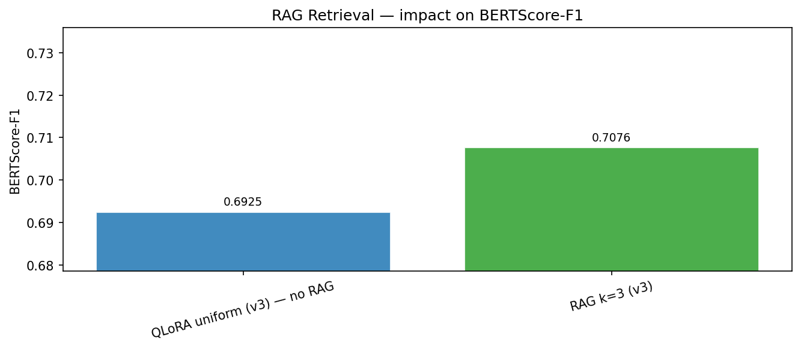
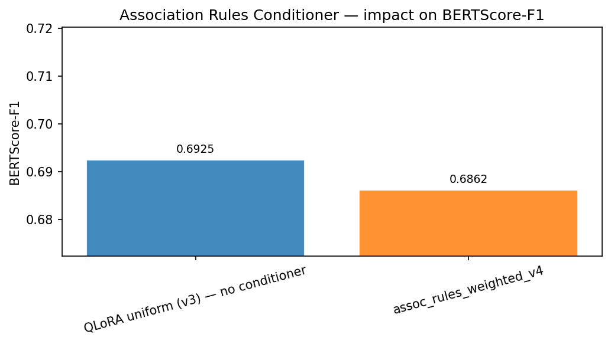
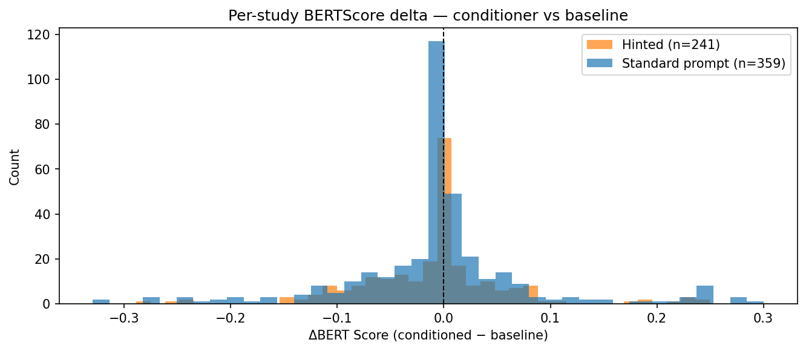
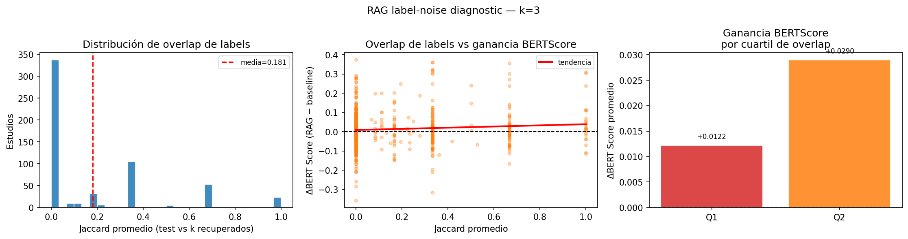
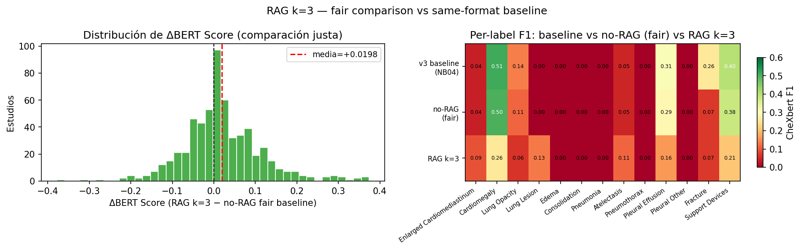
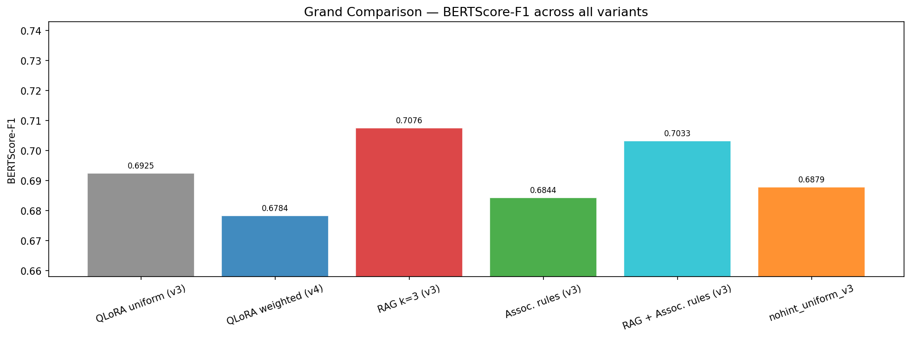

::: {.non-technical-summary}
##### Section Summary (Non-Technical)
This section explains two advanced techniques we use to improve the model's reports without having to perform additional expensive training. 

First, we use **Retrieval-Augmented Generation (RAG)**, which searches the training database at inference time for chest X-ray reports with similar clinical indications and injects them as examples in the model prompt. This gives the AI local reference points. 

Second, we use **Soft Label Priors**, which analyze training statistics to find which diseases commonly occur together (for example, fluid overload and lung congestion). When the model generates a report, we feed it these statistical likelihoods as hints, guiding it toward writing clinically logical findings.
:::

## 1. Case-Based Retrieval-Augmented Generation [@kang2025structuredradiology]

When a radiologist interprets a chest radiograph, they often refer to historical cases with similar clinical presentations. To replicate this case-based reasoning, we implement an inference-time Retrieval-Augmented Generation (RAG) strategy based on the work of Kang et al. [-@kang2025structuredradiology].

### 1.1 Vector Indexing & Similarity Matching
Because clinical indications are dense, structured text, we construct a CPU-efficient term frequency-inverse document frequency (TF-IDF) vectorizer over the training indications:

$$TF\text{-}IDF(t, d) = TF(t, d) \times IDF(t)$$

We extract unigrams and bigrams, capping features at 5,000 (actual vocabulary after fitting on 2,403 training indications: **3,329 features**). At inference time, the query indication $q$ is vectorized, and cosine similarity is computed against all training vectors:

$$\text{similarity}(q, d_i) = \frac{q \cdot d_i}{\|q\| \|d_i\|}$$

We set a similarity threshold of $0.05$. If matches exist, we select the top-$k$ (typically $k=3$ or $k=5$) corresponding training reports to act as few-shot clinical contexts.

### 1.2 Few-Shot Prompt Injection
The retrieved reference indications and findings are formatted and appended to the system prompt, as shown in the following structure:

```
You are an expert radiologist. Write only the Findings section...
The following are findings from similar studies for reference:
  Example 1 (similarity=0.72):
    Indication: Shortness of breath, history of smoking.
    Findings: Lungs are hyperexpanded with flattened diaphragms...

Indication: Patient with shortness of breath and low oxygen.
Findings:
```

This grounds the model in target-vocabulary phrasing before generation, helping to bridge the vocabulary mismatch gap.

---

## 2. Soft Label Priors via Association Rules

Medical findings do not occur in isolation; they follow logical clinical associations. To steer the decoder toward plausible reports without modifying model weights or gathering more data, we introduce soft label priors derived from label co-occurrence statistics mined from the training set.


### 2.1 Mining Co-occurrence Statistics
We compute a pairwise joint occurrence matrix from the binary CheXbert training labels ($L \in \{0, 1\}^{N \times 14}$):

$$C = \frac{L^T L}{N}$$

For each pair of labels $A$ and $B$, we compute the conditional probability (confidence) and lift:

$$P(B \mid A) = \frac{P(A \cap B)}{P(A)} = \frac{C_{A, B}}{\mu_A}$$

$$\text{Lift}(A \rightarrow B) = \frac{P(B \mid A)}{P(B)} = \frac{C_{A, B}}{\mu_A \mu_B}$$

Where $\mu_A$ represents the empirical prevalence of label $A$ in the dataset. Rules are sorted by confidence and filtered using thresholds (confidence $\ge 0.25$, lift $\ge 1.2$). The resulting joint statistics are saved to a heatmap.

### 2.2 Two-Tier Hint Selection

The `build_conditioned_prompt` function applies a strict priority hierarchy to decide which hint to inject:

**Primary — Empirical TF-IDF Prior:** We first retrieve the top-$K$ ($K=20$) training indications most similar to the query (cosine similarity threshold $\geq 0.05$) and compute the empirical label prevalence vector over that neighborhood:

$$\hat{P}(B \mid q) = \frac{1}{K} \sum_{i \in \text{top-}K} \mathbf{1}[B_i = 1]$$

Labels with $\hat{P}(B \mid q) \geq 0.30$ are injected as a structured prevalence hint. The `No Finding` label is explicitly excluded from the hint regardless of prevalence. If any label clears the threshold, this prior is used and the pipeline stops.

**Fallback — Keyword Association Rules:** Only when the TF-IDF neighborhood produces no label above the prevalence threshold, we fall back to keyword matching. We scan the indication text for 13 pathology keyword dictionaries with negation filtering (prefixes such as "rule out", "no evidence of", "r/o", "no ", "without " suppress the match within a 25-character context window). Triggered antecedents $A$ are then expanded via the mined rules: all consequents $B$ with confidence $\geq 0.25$ and lift $\geq 1.2$ are included in the hint.

The two paths produce distinct hint formats injected after the system prompt, before `Findings:`:

**TF-IDF prior (primary path):**
```
Clinical context (based on similar studies in training set):
  - Cardiomegaly: present in 30% of similar cases.
```

**Keyword association rules (fallback path):**
```
Clinical association context (training set statistics):
  - Edema co-occurs with Cardiomegaly in 61% of similar studies (lift=4.93).
  - Edema co-occurs with Lung Opacity in 39% of similar studies (lift=2.87).
  - Edema co-occurs with Pleural Effusion in 32% of similar studies (lift=10.20).
```

The fallback example above is for the indication *"Chest pain, history of CHF and pulmonary edema"* — the keyword `edema`/`chf` triggers the Edema antecedent, which expands to its three strongest consequents.

### 2.3 Hint Coverage in Practice

On the 600-study test set, the conditioner injects a hint into **241 studies (40.2%)**. The remaining 59.8% receive the standard prompt — either because the indication is empty/missing or because neither path produced a confident signal. Studies with no indication text always receive no hint.

This two-tier design prioritises the richer statistical signal of the neighbourhood prior when retrieval quality is sufficient, while ensuring broad coverage via the deterministic keyword fallback. The selection is fully deterministic (no sampling) and adds no latency beyond a CPU-side TF-IDF lookup.

---

## 3. Experimental Results & Prompt Engineering Trade-offs

We evaluated ten different configurations end-to-end on our holdout test set ($n=600$ studies). The results reveal a clear performance-style trade-off frontier. Rather than one single method dominating all others, we find two Pareto-optimal paths: a **fluency track** driven by RAG, and a **clinical precision track** driven by label prior conditioning.

### 3.1 Quantitative Metrics Comparison

To isolate the causal impact of the conditioning prompts from minor formatting shifts, we evaluated each strategy against its respective **fair baseline** (which uses the exact same template and `\nFindings:` suffix but without injecting hints or RAG examples). The `nohint_uniform_v3` and `nohint_weighted_v4` fair baselines are generated in Notebook 06 STEP 7 — they re-run inference on the same checkpoints with the conditioning prompt format but omitting the hint block, so any metric difference is causally attributable to the hint content.

#### Uniform Sampler Checkpoint (`uniform_v3`) Comparison

| Configuration | BERTScore-F1 | CheXbert micro-F1 | CheXbert macro-F1 | BLEU-4 | ROUGE-L |
|---|---|---|---|---|---|
| **Fair Baseline (`nohint_uniform_v3`)** | $0.6879$ | $0.4404$ | $0.1445$ | $0.1128$ | $0.2852$ |
| **RAG $k=3$ (`rag_k3_uniform_v3`)** | **$0.7076$** | $0.3432$ | $0.1160$ | **$0.1391$** | **$0.3051$** |
| **Assoc. Rules (`assoc_rules_uniform_v3`)** | $0.6844$ | **$0.4424$** | **$0.1745$** | $0.1100$ | $0.2812$ |
| **Combined RAG + Rules** | $0.7033$ | $0.2567$ | $0.0954$ | $0.1337$ | $0.2870$ |

#### Weighted Sampler Checkpoint (`weighted_v4`) Comparison

| Configuration | BERTScore-F1 | CheXbert micro-F1 | CheXbert macro-F1 | BLEU-4 | ROUGE-L |
|---|---|---|---|---|---|
| **Fair Baseline (`nohint_weighted_v4`)** | **$0.6876$** | $0.4526$ | $0.1581$ | **$0.1076$** | $0.2720$ |
| **Assoc. Rules (`assoc_rules_weighted_v4`)** | $0.6862$ | **$0.4559$** | **$0.1841$** | $0.1073$ | $0.2713$ |
| **Combined RAG + Rules** | $0.7019$ | $0.2694$ | $0.1037$ | $0.1352$ | **$0.2842$** |

::: {#fig-prompt-experiments layout="[[1, 1], [1]]"}
{#fig-rag-comp}

{#fig-assoc-comp}

{#fig-assoc-delta}

Prompt engineering ablation results on the test set.
:::

---

### 3.2 Analysis of the RAG Label Noise Problem

Retrieval-augmented generation ($k=3$) shows a major split in outcomes (see @fig-rag-comp):
*   **Textual Quality Gains**: BERTScore-F1 improves by $+0.020$ over the fair baseline, BLEU-4 rises by $+23\%$ relative, and ROUGE-L rises by $+7\%$. 
*   **Clinical Accuracy Degradation**: CheXbert micro-F1 drops by $-0.097$ ($-22\%$), and macro-F1 regresses by $-0.029$.

To diagnose this degradation, we performed a Jaccard similarity analysis between the true label vectors of the target studies and the retrieved training examples (see @fig-label-overlap).

::: {#fig-rag-diagnostics layout="[1, 1]"}
{#fig-label-overlap}

{#fig-rag-fair}

RAG retrieval quality and diagnostic statistics.
:::

The analysis reveals that **$57.5\%$ of retrievals share zero active labels (Jaccard = 0.0) with the target study**. Because clinical indications are brief and unstandardized (e.g. "pain," "pre-op"), TF-IDF similarity over indication text is clinically blind. It frequently retrieves normal reports for pathological X-rays or vice versa. 

Because the VLM anchors heavily to the retrieved examples, it copies their structured vocabulary verbatim. When retrieval is incorrect, the model copies incorrect clinical findings, introducing label noise. While this improves text fluency metrics (the copied text has excellent syntax), it severely harms diagnostic reliability. RAG is thus unsuitable for clinical triage where pathology recall is critical, unless paired with a label-aware retriever.

---

### 3.3 Analysis of Association Rules Conditioner

In contrast to RAG, the association rules conditioner achieves clinical precision gains with near-zero fluency penalty (see @fig-assoc-comp and @fig-assoc-delta):
*   **True Conditioner Effect**: Compared to the fair baseline, the conditioner yields **$+0.030$ CheXbert macro-F1** ($+20.8\%$) for `uniform_v3` and **$+0.026$** ($+16.5\%$) for `weighted_v4`, while costing only $-0.0035$ BERTScore.
*   **Unlocking Rare Pathologies**: The conditioner successfully activates detection for classes that the base models completely missed. For example, **Edema** (which scored $0.0$ in zero-shot, baseline, and RAG runs) rises to **$0.222$** with `uniform_v3` and **$0.200$** with `weighted_v4`. The conditioner uses co-occurrence rules to nudge the model to report edema when indications suggest congestive heart failure and cardiac enlargement is detected in the image.

---

### 3.4 Destructive Interference in Combined Prompts

When we naively combine both conditioning signals (RAG examples + label prior hints), the model suffers a **catastrophic clinical collapse**: CheXbert micro-F1 drops to $0.2567$ (the lowest observed across all runs), and macro-F1 collapses to $0.0954$ (worse than zero-shot).

This collapse occurs due to a format conflict:
1.  The retrieved findings text in the RAG block acts as a concrete generation template.
2.  The label prior hint provides abstract statistical guidance.
3.  The model's attention mechanism prioritizes the concrete template, completely overriding the statistical guidance.

As a result, the rare pathology detections unlocked by the sampler and rules are erased (Edema drops back to $0.0$, and Pleural Effusion drops from $0.345$ to $0.0$). Thus, combining RAG and statistical hints is counter-productive.

---

### 3.5 Additive Synergy: Weighted Sampler + Association Rules

The highest overall rare-label coverage is achieved by combining training-time weighting and inference-time association rules: **`assoc_rules_weighted_v4` reaches a test-set macro-F1 of $0.1841$** ($+30\%$ over zero-shot).

Unlike RAG + rules, training-time conditioning (the ESS-based `WeightedRandomSampler`) and inference-time conditioning (the association rules conditioner) do not compete. The weighted sampler alters the model's internal representations during backpropagation, while the conditioner alters the attention distribution during decoding. Because they operate at different layers of the generation pipeline, their effects are additive. For example, `weighted_v4` is the only model that learns to detect **Lung Lesion** ($0.154$ F1) without hints, and adding the conditioner preserves this capability while unlocking Edema ($0.200$ F1).

::: {#fig-grand-comparison-layout layout="[[1, 1], [1]]"}
{#fig-grand-comp}

{#fig-scatter}

{#fig-heatmap}

Grand comparison of all ten configurations.
:::

The overall trade-off space is visualized in @fig-scatter and @fig-heatmap. The scatter plot maps the Pareto frontier: RAG occupies the high-fluency/low-precision region, while `assoc_rules_weighted_v4` occupies the high-precision/low-fluency region. The heatmap (@fig-heatmap) illustrates how the weighted sampler and association rules conditioner stack together to achieve the most balanced and comprehensive clinical detection profiles.

