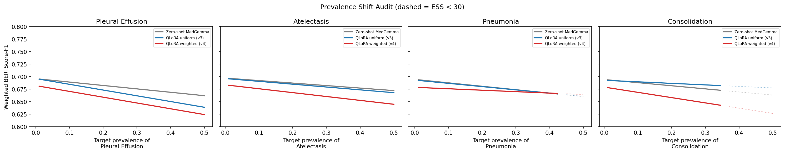

::: {.non-technical-summary}
##### Section Summary (Non-Technical)
This section describes our system stress-testing infrastructure. Rather than hoping the model works when moved to a new hospital, we built a diagnostic program that simulates two types of distributional shift: scanner hardware differences (adding noise, changing brightness, contrast, and compression) and epidemiological differences (simulating higher rates of rare diseases). The results reveal an important safety blind spot: the model appears robust under image degradation, but this is a statistical illusion — not a genuine robustness guarantee.
:::

## Overview of the Audit Protocol

To evaluate the system's readiness for Latin American clinical environments, we built the `DomainShiftAudit` infrastructure (`src/domain_shift_audit/`). It defines a unified `DomainShiftAudit` class with individual sub-modules for each shift axis. Two axes were fully executed on the test set; a third (language shift — Spanish generation) was designed and scaffolded but not executed due to the absence of Spanish-language reference data.

| Axis | Type | Status |
|---|---|---|
| **A** | Acquisition & Equipment Shift | **Executed** — results in this section |
| **B** | Prevalence Shift | **Executed** — results in this section |
| Language | Language Shift (Spanish generation) | Scaffolded, not executed — `NotImplementedError` stubs in `src/domain_shift_audit/language_shift.py` |

---

## Axis A: Acquisition & Equipment Shift

We apply controlled synthetic image perturbations to simulate differences in scanner hardware, sensor noise, or digitisation quality. The `acquisition_shift.py` module implements five perturbation functions applied at a fixed `seed=42` for reproducibility:

| Perturbation | Magnitude range | Clinical analogue |
|---|---|---|
| `gaussian_noise` | σ ∈ [0, 5, 15, 30, 50] px | Detector noise, low-dose protocol |
| `contrast` | c ∈ [0.5, 0.7, 1.0, 1.5, 2.0] | Dynamic range compression |
| `gamma` | γ ∈ [0.5, 0.75, 1.0, 1.5, 2.0] | Exposure curve differences between vendors |
| `jpeg_compression` | q ∈ [95, 75, 50, 25, 10] | Lossy PACS/network compression |
| `brightness` | b ∈ [0.5, 0.7, 1.0, 1.3, 1.6] | Exposure level calibration offset |

For each perturbation type, the full test set (600 studies) is perturbed at every magnitude and BERTScore-F1 is recomputed against the original ground-truth reports. The evaluation was run on the `uniform_v3` checkpoint. Results are cached per perturbation type to `reports/acq_shift_uniform_v3_{type}.json`.

::: {#fig-acquisition-shift-container}
{#fig-acquisition-shift}

BERTScore-F1 as a function of perturbation magnitude for each of the five perturbation types. The y-axis is truncated to [0.50, 0.80] to show structure.
:::

### A.1 Results & Safety-Critical Finding

All perturbations cause **less than 1.3% BERTScore-F1 degradation** across the entire tested range — including extreme conditions (JPEG quality = 10, Gaussian noise σ = 50). This superficially suggests the model is extremely robust to equipment shift.

It is not. This is a **metric artefact with a serious clinical implication**:

- **Encoder corruption**: Under severe noise or compression, the frozen SigLIP vision encoder's perceptual representations degrade, losing the visual signal entirely.
- **Decoder defaulting**: When visual information is lost, the Gemma decoder falls back to its language prior. It generates fluent, grammatically correct reports describing completely normal findings: *"The lungs are clear. There is no pleural effusion or pneumothorax..."*
- **Metric masking**: Because the test set is 38.7% "No Finding" and the remaining pathologies are individually rare, hallucinated "normal" reports align well with the majority class. BERTScore-F1 remains high (~0.69) even when the model is completely blind to any pathology present in the image.

**Conclusion**: Apparent robustness under acquisition shift is an artefact of class imbalance. In practice, visual corruption renders the model clinically blind — it produces fluent, confidently normal reports while missing all pathology, with no detectable signal in BERTScore. A pathology-grounded metric (e.g. CheXbert macro-F1) would expose this collapse, but is itself confounded by the vocabulary mismatch described in [Section 4](04_evaluation.qmd).

---

## Axis B: Prevalence Shift

Medical centres in LATAM exhibit different disease prevalence distributions compared to US benchmark datasets (e.g., higher rates of Tuberculosis, Chagas, Consolidation from endemic respiratory infections). We simulate this shift by re-weighting the test set using importance sampling.

### B.1 Methodology

For each study $i$ and shift label $l$ with source prevalence $p_l$, the importance weight is:

$$w_i = \frac{\pi_{\text{target}}(y_{i,l})}{\pi_{\text{source}}(y_{i,l})} = \begin{cases} \dfrac{\pi_{\text{target}}}{p_l} & \text{if } y_{i,l} = 1 \\[6pt] \dfrac{1 - \pi_{\text{target}}}{1 - p_l} & \text{if } y_{i,l} = 0 \end{cases}$$

The weighted metric estimate is:

$$\hat{F}_{\text{target}} = \frac{\sum_i w_i \cdot F_i}{\sum_i w_i}$$

where $F_i$ is the per-study BERTScore-F1. Statistical reliability is controlled via the Effective Sample Size:

$$\text{ESS} = \frac{\left(\sum_{i=1}^N w_i\right)^2}{\sum_{i=1}^N w_j^2}$$

Estimates with $\text{ESS} < 30$ are plotted as dashed lines — the re-weighting estimator becomes unstable when target prevalence pushes far beyond the source distribution, because the test set contains too few positive examples to provide reliable weight.

### B.2 Labels Audited

We swept the target prevalence of four pathologies from 1% to 50% (20 steps, `np.linspace(0.01, 0.50, 20)`):

| Label | Source prevalence (IU CXR test set) | LATAM motivation |
|---|---|---|
| Pleural Effusion | 3.1% | Common in TB, CHF, malnutrition |
| Atelectasis | 6.7% | Post-procedural, common in referral populations |
| Pneumonia | 0.9% | Higher burden in LATAM public health settings |
| Consolidation | 0.7% | Bacterial pneumonia, endemic respiratory infections |

Both the zero-shot baseline, `uniform_v3`, and `weighted_v4` checkpoints are evaluated. Per-study BERTScore-F1 scores are loaded from the cached metric files produced in Notebook 04.

::: {#fig-prevalence-shift-container}
{#fig-prevalence-shift}

Importance-weighted BERTScore-F1 across target prevalence sweeps for four LATAM-relevant labels. Dashed lines indicate unreliable regions (ESS < 30). Each panel holds a different shift label; all three model variants are overlaid.
:::

### B.3 Results Analysis

**Estimation stability.** Dashed regions appear as target prevalence exceeds roughly 25–35% for most labels. At this point, the importance weights on the rare positive studies in the test set become extreme, and the ESS collapses below 30. The estimator is unreliable in these regions — they represent extrapolation, not measurement.

**Uniform vs. weighted model.** The ESS-weighted `weighted_v4` model shows more stable weighted BERTScore-F1 than both the zero-shot baseline and `uniform_v3` as target pathology prevalence increases. The gap widens as prevalence grows, which is exactly the expected behaviour: a model that was shown rare-pathology studies more frequently during training is better calibrated when those pathologies become more common at deployment.

**Practical implication.** If the target deployment population has even 10–15% Pleural Effusion prevalence (not implausible for a referral cardiology clinic), the uniform model's BERTScore degrades meaningfully while `weighted_v4` remains stable. Training-time distribution correction translates directly to deployment-time robustness.
